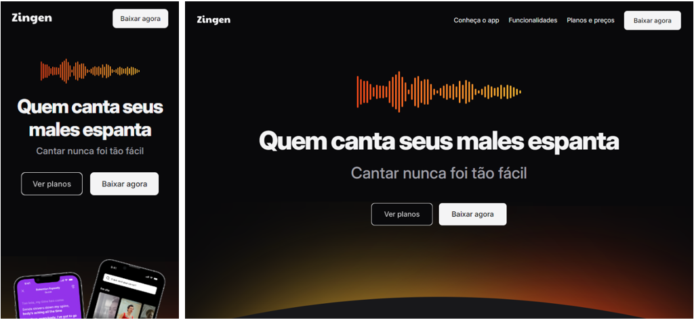

<h1 align="center"> Landing page de aplicativo Zingen </h1> 
 Landing page completa para aplicativo de karaokê com foco diferenciado em responsividade, apresentando layouts diferenciados conforme tipo de tela.   Desenvolvido como projeto de prática intensiva em **HTML, CSS modular e componentes interativos**. 
 
 <a href="#-tecnologias">Tecnologias</a>&nbsp;&nbsp;&nbsp;|&nbsp;&nbsp;&nbsp; <a href="#-projeto">Projeto</a>&nbsp;&nbsp;&nbsp;|&nbsp;&nbsp;&nbsp; <a href="#-layout">Layout</a>&nbsp;&nbsp;&nbsp;|&nbsp;&nbsp;&nbsp; <a href="#-estrutura">Estrutura</a>&nbsp;&nbsp;&nbsp;|&nbsp;&nbsp;&nbsp; <a href="#-funcionalidades">Funcionalidades</a>&nbsp;&nbsp;&nbsp;|&nbsp;&nbsp;&nbsp; <a href="#-aprendizados">Aprendizados</a> 
 
  
   
  

🚀 Tecnologias
Esse projeto foi construído utilizando:

- HTML5 — estrutura semântica

- CSS3 modularizado — componentes, organização por seções e arquivos separados

- SVG Icons — ícones otimizados

- Figma — referência visual

- Git e GitHub

💻 Projeto

O objetivo do projeto é criar uma landing page moderna, elegante e totalmente estilizada, permitindo ao usuário:

- saber mais sobre o produto

- conhecer suas funcionalidades

- escolher entre planos e preços

O projeto é focado em prática real de interface, respeitando espaçamentos, hierarquia e comportamento idêntico ao layout do Figma.

🎨 Layout

O design segue:

- Paleta dark elegante com tons em cinza, branco e laranja

- Botões com estados de hover, foco e seleção diferentes

- Botões bordas e textos em gradientes

📚 Estrutura

A página contém:

- Header com links de navegação

- Hero section atraente

- Seção "conheça o app", apresentando o aplicativo

- Seção "funcionalidades", trazendo todas as características do app

- Seção "planos e preços", trazendo todos os planos, preços e distinções entre eles

- Seção "download" com link para a App Store e Google Play

- footer com links para as seções anteriores, links da empresa e redes sociais

🔧 Funcionalidades

- Seções com transições suaves

- Botões com textos e bordas altenando estilos entre normal e hover

- botões diferenciados com textos e bordas em degradê

- Cards elegantes com ícones, textos e imagens estilizados

- perfeitamente adaptado para telas maiores (desktop) e menores (smartphones), incluindo layout diferenciado entre elas

🧪 Aprendizados

Durante o desenvolvimento, foram trabalhados:

- Controle total de estilização de inputs nativos

- Uso avançado de ::before, ::after e :has()

- Organização modular e escalável de CSS

- Hierarquia visual seguindo um layout real

- Correções de espaçamento, alinhamento e comportamento

- Utilização maior de variáveis para ganho de tempo e controle na estilização

- Aplicação dos conceitos de responsividade entre telas diferentes

📜 Licença

Esse projeto está sob a licença MIT.

✨ Desenvolvido com dedicação por Fabiano Ferreira.